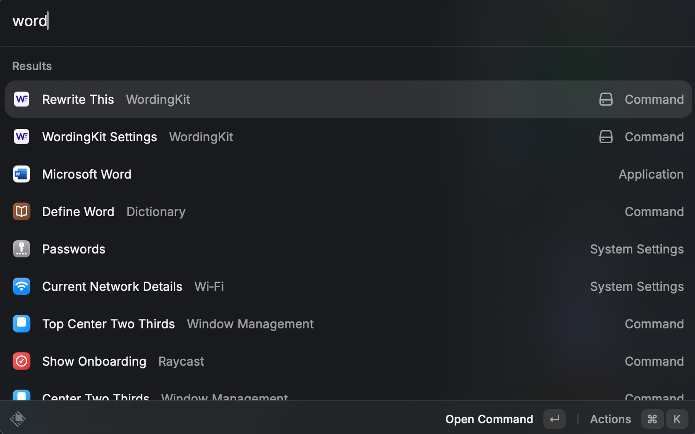

# WordingKit

WordingKit is a Raycast extension for rewriting selected text in any macOS app.
It supports local Ollama models and optional cloud providers, so you can keep
everyday rewriting local while still using OpenAI, Anthropic, or Groq when you
need them.



## Features

- Rewrite selected text from the active macOS app and paste the result back with
  one action.
- Use built-in language-preserving editing modes for grammar fixes, clarity,
  shortening, formal tone, work chat, social posts, and more.
- Create custom modes with a provider, model, system prompt, temperature, and
  token limit.
- Sort modes manually or by last use.
- Run against local Ollama by default, with optional OpenAI, Anthropic, and Groq
  API support.
- Keep provider credentials in Raycast Preferences instead of source files.

## Requirements

- macOS with Raycast installed.
- Node.js 22 or newer for local development.
- Ollama running at `http://127.0.0.1:11434` for the default local provider.
- Optional API keys for OpenAI, Anthropic, or Groq if you use cloud modes.

## Installation from source

Clone the repository, install dependencies, and start Raycast development mode:

```bash
git clone https://github.com/suregoodru/wordingkit.git
cd wordingkit
npm ci
npm run dev
```

Raycast opens the extension in development mode. Configure provider keys and the
Ollama URL in Raycast Preferences for WordingKit.

## Development

```bash
npm ci
npm run dev
```

## Commands

| Command                       | Purpose                                                                                            |
| ----------------------------- | -------------------------------------------------------------------------------------------------- |
| `npm run dev`                 | Start Raycast development mode.                                                                    |
| `npm test`                    | Run Node.js tests for provider contracts, mode storage, manifest expectations, and UI flow guards. |
| `npm run lint`                | Run Raycast lint checks.                                                                           |
| `npm run build`               | Build and validate the Raycast extension.                                                          |
| `npm run eval:generate-modes` | Regenerate manual evaluation modes from `src/tones.ts`.                                            |
| `npm run eval:rewrites`       | Run opt-in manual rewrite evaluation through configured providers.                                 |

## Configuration

WordingKit reads provider configuration from Raycast Preferences:

| Preference        | Required | Used for                                                                                   |
| ----------------- | -------: | ------------------------------------------------------------------------------------------ |
| `openaiApiKey`    |       No | OpenAI modes.                                                                              |
| `anthropicApiKey` |       No | Anthropic modes.                                                                           |
| `groqApiKey`      |       No | Groq modes.                                                                                |
| `ollamaUrl`       |       No | Ollama endpoint, defaulting to `http://127.0.0.1:11434`.                                   |
| `presetLanguage`  |       No | Language used only when a confirmed Reset replaces all editing modes; defaults to English. |

The default built-in modes use Ollama model `qwen3:14b`. You can edit or replace
modes from `WordingKit Settings`. The Raycast UI remains in US English. English
and Russian presets are available through `presetLanguage`; changing the
preference does not modify existing modes until you confirm Reset.

## Privacy and security

- WordingKit has no backend service and does not store provider responses on a
  remote server.
- Selected text is sent only to the provider configured for the active mode.
- Ollama modes call your local Ollama server.
- Cloud modes call the selected provider API directly from the Raycast
  extension.
- API keys are configured as Raycast password preferences and must not be stored
  in repository files, logs, screenshots, or issue reports.
- Provider error messages are sanitized so configured API keys are replaced with
  `[REDACTED]` before they are shown.

## Repository hygiene

Before publishing screenshots, evaluation messages, or issue examples, make sure
they do not contain private text, customer data, access tokens, or internal
URLs. Generated manual evaluation reports live in `manual-eval/reports/` and are
ignored by Git.

## Manual rewrite evaluation

Manual evaluation is an opt-in workflow for comparing rewrite quality across
the default WordingKit modes and selected Ollama models. It is not part of
`npm test`, `npm run build`, `npm run dev`, lint, or the Raycast runtime.

### Editable inputs

- `manual-eval/messages.json` — source messages to rewrite. Keep this as an
  array of strings. The current set is intentionally small and mixed by length:
  one short message, three medium messages, and three longer technical messages.
- `manual-eval/models.json` — Ollama model names to evaluate, for example
  `qwen3:14b`.

### Generated inputs and reports

- `manual-eval/modes.json` — generated from `manual-eval/models.json` and
  `src/tones.ts`. Do not edit it by hand unless you are debugging the generator.
- `manual-eval/reports/` — generated Markdown and JSON reports. This directory
  is ignored by Git.

### Commands

Regenerate `manual-eval/modes.json` without calling any model:

```bash
npm run eval:generate-modes
```

Run the full rewrite evaluation:

```bash
npm run eval:rewrites
```

`npm run eval:rewrites` regenerates `manual-eval/modes.json` first, then runs
every message through every generated mode sequentially. This keeps the payloads
aligned with the real WordingKit prompts in `src/tones.ts` and reduces pressure
on local Ollama.

### Environment

For Ollama-only runs, make sure Ollama is running. The script uses
`OLLAMA_URL` when it is set; otherwise the provider default is used.

Cloud providers are supported by the same provider path as the app, but the
manual generator currently creates Ollama modes. If you add cloud modes manually,
set the matching environment variables before running evaluation:

```bash
OPENAI_API_KEY=...
ANTHROPIC_API_KEY=...
GROQ_API_KEY=...
OLLAMA_URL=http://127.0.0.1:11434
```

The Markdown report is optimized for reading: original messages and rewritten
outputs wrap as normal Markdown text, and the JSON report keeps raw structured
results for later comparison.

## Contributing

Bug reports, focused feature requests, and pull requests are welcome. Start with
[`CONTRIBUTING.md`](CONTRIBUTING.md), and use
[`SECURITY.md`](SECURITY.md) for vulnerability reports.
